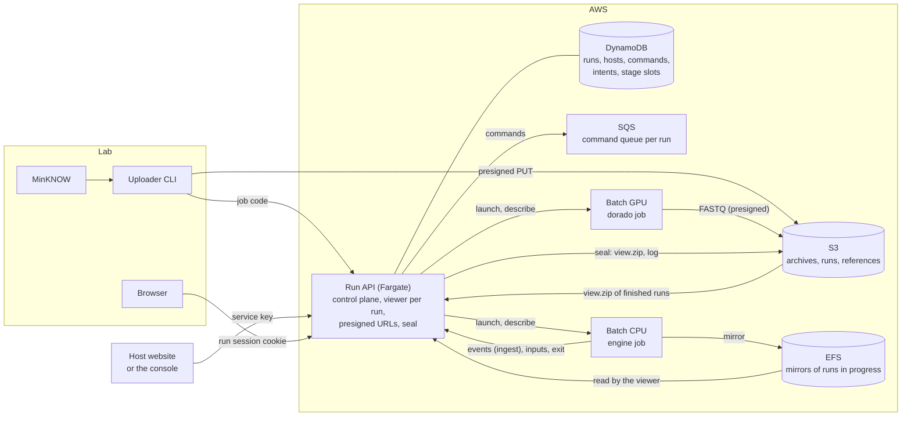
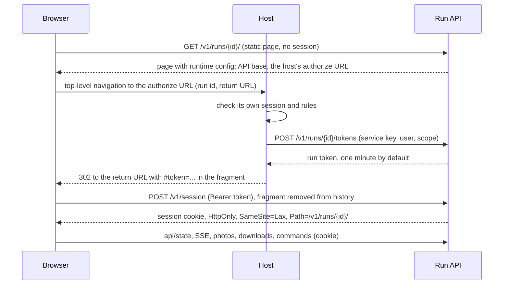

# specimux-cloud design

How the hosted form of specimux-suite is built, and why. The README covers
using the service, deploying it, and a summary of how the pieces talk;
this document records the reasoning and the mechanisms that are not
obvious from the code. It assumes familiarity with the suite's own
architecture (event-sourced pipeline, the viewer app factory, the commands
facade, plugins; see the suite's CLAUDE.md and INTEGRATION.md).

## System topology

Three homes, each with a narrow job:

| Home | Owns | Must not know about |
|---|---|---|
| **specimux-suite** (the engine) | The pipeline, the viewer app and its pages, `derived.js`, the event contract. Runs one job in one output dir. | AWS, hosts, identity, other runs. |
| **specimux-cloud** (the service) | Infrastructure (`infra/`), the engine and dorado images, the cloud plugin loaded into the engine, the run API, the console, the uploader, storage layout, stage limits, retention. | Who a user is beyond what a host vouches for. |
| **A host** (a website such as mycomap.org, or the built-in console) | Its users, their permissions, the page where a run is set up, and an authorize route that vouches for a user. | The pipeline, the event schema, AWS. |

The suite stays cloud-unaware and keeps working offline: everything the
cloud needs attaches through the suite's extension interface, and a local
run is unchanged by it.



Jobs never hold AWS credentials for the bucket: every input and output
moves over a presigned URL the run API hands out, and every control call a
job makes goes to the run API with its job secret.

## The engine container

### The suite's extension interface

The cloud attaches to the engine through three pieces of the suite, each
useful locally too:

1. **The viewer app factory** builds the read side of the web server
   (`api/state`, SSE `events`, `api/specimens`, `api/sequence/...`,
   photos, the pages) from any event source plus an output dir, with no
   pipeline. The run API mounts one per run over its ingest log.
2. **The commands facade** is the one way to act on a run (`watch`,
   `unwatch`, `correct`, `dismiss`, `rescan`, `finalize`, `abort`). Every
   mutation event carries an actor and a command id, every command closes
   with a `command.outcome` event, and a command id the log has already
   seen is a no-op, so redelivery is harmless.
3. **Plugins** get the event log, the commands facade, config and output
   dir, with start and shutdown hooks. The cloud plugin
   (`engine/plugin.py`) is two threads: the suite's HTTP event forwarder
   posting batches to `ingest` with the generation attached, and a command
   poller that long-polls the run API and applies each command through the
   facade.

A sidecar driving the engine through its localhost web API would have
needed no suite change, but it would re-parse the engine's own SSE, replay
browser admin routes with their loopback headers, and supervise the engine
as a puppet of its HTTP surface. The interface is small, tested locally,
and the viewer split pays for itself in the suite regardless.

Commands stay separate from events on purpose: the engine's `EventLog` is
the single writer of a run's log, and a user action is a command the
engine turns into an event, exactly as on a laptop.

### Engine storage

The engine works in a fresh directory on the job's local disk
(`SPECIMUX_SCRATCH`, a host volume on a 100 GB gp3 root) and mirrors only
what the dashboard reads into the run's EFS directory with the suite's
`--mirror-dir`: the event log, `consensus/<id>/<id>-all.fasta`, top-level
`summary/*-RiC*.fasta` and the photo cache. Each mirrored file is replaced
atomically and lands before the event that announces it, so the viewer
never sees an announced file missing or half-written.

The first design put the whole output dir on EFS. The first full-scale run
showed why that fails: demultiplexing ran at about 190 reads/s with the CPU
at 1%, roughly four EFS metadata operations per read, where the same image
on local disk demultiplexed 1,016,873 reads in 26 s and finished the whole
run in 32 minutes. Speconsense's debug files have the same shape.

What local disk gives up is resuming in place. A relaunch (a new
generation, or a Batch retry of the same one) starts over with fresh
scratch and a fresh mirror; the earlier attempt's mirror is kept beside it
as `output.<time>`. At these speeds starting over costs less than working
on EFS every time, and it needs no recovery protocol for a copy of a
changing directory, which is why a mirrored hot directory was rejected
before it was measured. The run API keeps one viewer per engine
generation and rebuilds it when a newer generation's events arrive.

### What the wrapper does

`specimux-cloud engine` runs outside the engine process, so an engine
crash and a wrapper failure are distinguishable and the exit report is
sent even when the engine dies.

- **Inputs.** It fetches the job bundle (spec, presigned inputs, the
  manifest's reads) and downloads to scratch. Batch mode concatenates the
  manifest's files into one FASTQ, decompressing `.fastq.gz`. Live mode is
  under "Live runs".
- **Exit.** After the engine exits it builds the three downloads
  (`packages.py`) from local output, uploads them over presigned URLs
  (`package-uploads`), writes `engine-exit.json` into the run's EFS
  directory, and reports the exit code, log tail and packages. The exit
  record matters because Batch retries a job whose host died: a retry of
  the same generation that finds the record reports it instead of running
  the engine again.
- **SIGTERM** (a cancel, a timeout, a reclaimed host) stops the engine and
  reports exit 143 inside Batch's 30-second window, with no exit record,
  so a retry of that generation runs the engine again.
- **Lease.** `lease.json` in the run's EFS directory carries the
  generation and a heartbeat; a wrapper refuses to start over any lease of
  a newer generation, or a live one of its own. On NFS this is a guard, not a proof;
  the run API's generation check is the fence (see "Generations and
  fencing").

The dorado wrapper (`dorado/wrapper.py`) follows the same shape with only
the standard library, so the dorado image is the dorado tarball, its
models and one module.

## The run API

One always-on service. It is the only thing the browser, the uploader,
hosts and jobs talk to:

1. **Event store and viewer.** The engine's `events.jsonl` in the EFS
   mirror is the persisted record: one writer, monotonic versions. Ingest
   pushes the same events for latency and fan-out; `IngestLog` dedupes by
   version, holds early arrivals until a gap fills, and fills a gap (or
   rebuilds after a restart) from the file. Each run's viewer is the
   suite's app factory over that log. Downloading the sealed log and
   replaying it locally reproduces the dashboard, as for a local run.
2. **Job control.** Runs, stages, launches, cancel and retry, commands,
   reconciliation. State is in DynamoDB (see "Control-plane state").
3. **Uploads and results.** Presigned PUTs for the uploader, presigned
   GETs and PUTs for jobs, and 302s to presigned URLs for downloads, so no
   run data passes through the task.

**Why the run API fronts the command queue.** Jobs long-poll
`commands/next` rather than reading SQS directly. That keeps one engine
code path over both queue backends (SQS in AWS, memory locally) and one
credential per job, the job secret, instead of IAM access to a queue.

It runs as one Fargate task with the EFS mounted. SSE fan-out is
in-process, so a second task would need shared pub/sub or routing by run
id; nothing precludes that later. The load balancer's idle timeout is
120 s and the viewer's SSE sends a keepalive every 15 s. Deploys replace
the task in place: engines' forwarders retry across the gap, dashboards
reconnect with `Last-Event-ID`, and a job's exit report retries for up to
half an hour.

### Routes

All under `/v1`. "Service key" routes see only the calling host's runs.

| Route | Caller | Credential |
|---|---|---|
| `POST /runs` (multipart: spec, files, optional `client_token`, `reference_sha256`) | host | service key |
| `GET /runs`, `GET /runs/{id}`, `DELETE /runs/{id}` | host | service key |
| `POST /runs/{id}/cancel`, `.../retry`, `.../job-code`, `.../public` | host | service key |
| `POST /runs/{id}/tokens` (mint a run token) | host's authorize route | service key |
| `GET /hosts/me`, `GET /options`, `GET /load`, `GET /references/sha256/{hex}` | host | service key |
| `GET /version` | anyone | none |
| `POST /runs/{id}/uploads` (presigned PUTs) | uploader | job code |
| `GET /runs/{id}/upload` (does the run still take uploads) | uploader | job code, also after the run closes |
| `POST /runs/{id}/complete` (manifest, or none: built from the listing) | uploader, host | job code or service key |
| `GET /runs/{id}/job` (bundle) | any job | job secret, active job |
| `POST /runs/{id}/ingest`, `.../inputs`, `.../package-uploads`, `GET .../commands/next`, `POST .../commands/{msg}/ack` | engine job | job secret, engine stage |
| `POST /runs/{id}/basecalled` | dorado job | job secret, dorado stage |
| `POST /runs/{id}/exit` | any job | job secret, also after the job ended |
| `POST /session` (token → cookie) | browser | run token or share token (Bearer) |
| `GET /runs/{id}/`, `/present`, `/admin`, `/static/...` | browser | none (the page then gets a session) |
| `GET /runs/{id}/api/...`, `.../events`, `.../photos/...` | browser | run session cookie |
| `POST /runs/{id}/commands` | browser | session; admin scope for admin commands |
| `GET /runs/{id}/{results,output,reads}.zip`, `.../events.jsonl` | browser, host | session or service key; 302 to presigned URL |
| `GET /ui/{version}/{path}` (page templates) | a host that serves the pages itself | none |

## Run lifecycle

A run has a mode (batch or live) and an input kind (FASTQ or POD5). Batch
FASTQ, batch POD5 and live FASTQ are built; live POD5 is refused at
creation (see "Basecalling stage").

### Run states

| State | Entered when |
|---|---|
| `created` | `POST /runs`: spec and inputs stored, job code issued |
| `uploading` | the first presign request; a live run's engine launches here |
| `input_complete` | `complete` fixed the manifest; also a run waiting for a free stage slot, and a POD5 run between basecalling and the engine |
| `basecalling` | POD5 only: the dorado job holds a slot |
| `running` | the engine job holds a slot |
| `finalizing` | the engine emitted `finalization.started` |
| `sealing` | the engine's exit was recorded; the seal is copying the mirror to S3 |
| `sealed` / `failed` | the seal finished after exit 0 / anything else |
| `incomplete` | an upload was abandoned (below); keeps what arrived, never reports success |

**Abandoned uploads.** The two-minute reconcile ends a run with no upload
request for 24 hours, or created and never uploaded to within 7 days (a
lab may create a run days before sequencing ends), as `incomplete` with
`exit.stage: upload`. The uploader's status checks are deliberately not
activity, or a forgotten watching uploader would hold its run open for
ever. A live run is different: its upload idle for 3 hours is *completed*
with what arrived, so the engine finalizes instead of idling on an
instance.

### Completion barrier

Completion is a verifiable barrier, not a signal. `complete` carries a
manifest of every uploaded object (key, size, S3 ETag); the run API checks
each against the storage listing and refuses a missing or changed object.
Without a manifest (the run page's **Upload is complete**, or the live
idle rule) it is built from the listing at that moment. Either way the job
code stops working, so nothing later joins the run. Jobs work from the
manifest, not from the bucket: the batch bundle presigns exactly the
manifest's keys, and the live feed filters the listing to manifest entries
whose ETag still matches.

"Processed" is defined by the engine, not the wrapper: a file counts once
the engine has emitted `specimux.completed` for it, which the run API
records from ingest (`ingested_files`). The dorado stage succeeds only
when every manifest POD5 has its FASTQ in storage (the listing is the
truth, the job's reports the bookkeeping). S3 event notifications are not
used anywhere: they are at-least-once and unordered, and something would
have to consume the first one; listings and the manifest are the truth,
and jobs launch from authenticated requests (`complete`, or a live run's
first presign).

### Live runs

A live run's engine launches on the first presign (or when an engine slot
frees) and uploads stay open while it runs (`uploads_open(run)`), until
`complete` fixes the manifest. The wrapper, not S3, feeds the engine:
`LiveFeed` polls `POST /runs/{id}/inputs` every 10 s, which returns the
files the engine lacks (presigned), whether the upload is complete, and
which files ingest has seen demultiplexed. Each file is downloaded beside
the engine's watch dir on local disk and renamed in, so the suite's
watcher never sees a partial file and a 5 s settle time suffices. Once the
upload is complete and every manifest file is both delivered and
demultiplexed, the wrapper sends the engine SIGINT, which the suite
already treats as "finalize and exit" (a dashboard `finalize` command
finalizes without exiting, which is right for a laptop and wrong here).

Live engine jobs override the job definition's 12-hour attempt timeout
with 96 hours (a MinION run is up to 72). A relaunch replays every
uploaded file into a fresh engine, the same trade as "Engine storage".

### Basecalling stage

Basecalling belongs to the service, not the suite: the suite keeps taking
FASTQ, and basecalling progress is run-record status, not suite events.

**GPU, and an accurate model.** Dorado runs on CPU, but with HAC or SUP a
CPU takes many hours to a day for a run a GPU does in under an hour, and
costs more in instance hours. The fast model is rejected for a different
reason: it changes the data (more reads failing primer and barcode
matching, noisier clusters) against every baseline the suite has been
validated on. The default follows the published protocol:
`dorado basecaller sup@v5.0.0 --no-trim`, then a 400–2000 base length
window for the full ITS amplicon, no qscore floor. The model must be one
the dorado image bakes (`SPECIMUX_DORADO_MODELS` in the stack, kept in
step with `docker/dorado.Dockerfile`), so no model downloads at run time.
Dorado runs without barcode-kit options; specimux demultiplexes.

**As built (batch POD5).** `complete` launches one dorado job in a free
dorado slot. It takes the manifest's POD5 files one at a time (scratch
holds one POD5 and its FASTQ), writes each FASTQ to
`runs/<user>/<run>/fastq/<name>.fastq` over a presigned PUT and reports
it. A job that dies leaves what it delivered, and a relaunch skips those.
On success the run returns to `input_complete` with the FASTQs as the
engine's reads, and the engine launches at the next generation.

**The GPU environment** is xlarge G instances (g6, g5, g6e: one GPU,
4 vCPUs, so two fit the default 8-vCPU G quota), zero when idle, on
demand. Spot capacity for G instances needs a separate quota; per-file
fan-out across Spot GPUs is the natural speedup once that exists. A third
availability zone is in the GPU environment only, because G capacity is
often exhausted in one or two zones.

**Live POD5, not built.** A MinION's peak output is basecalled by one GPU
in minutes per hour, so a GPU held for a whole live run idles most of the
time. The intended shape is a dorado job per burst that exits when caught
up and releases the GPU, beside a running engine; per-stage job identity
("Generations and fencing") already allows a dorado and an engine job on
one run at once. Periodic small batches during a run were rejected: a GPU
instance takes minutes to boot and load a multi-gigabyte image and model.

## Identity and authorization

The run API does not know users; it knows **hosts**. A host creates runs
and vouches for its users, and the run API never sees the host's rules,
only their outcome as a token request or its absence.

### Hosts and service keys

A host record holds an id, a name, hashed service keys with labels, an
**authorize URL**, a disabled flag, a token-lifetime cap and theme fields
(stored, not yet applied to the pages). Keys are `<host id>.<random>`, so a
presented key names its host and only that host's hashes are checked; a
key is shown once. A host may hold several labelled keys (its server, a
person at the console), a rotated key stays valid for a day so a host can
roll its configuration, and the label in use is the actor recorded when no
finer identity exists.

Every run carries its host, and every service-key route is scoped to it:
listing, status, results, delete and token minting see only that host's
runs, and another host's run is a 404. Everyone holding one host's keys
sees all of that host's runs; finer separation is the host's job.

### Run tokens, sessions and the browser



The reasoning behind each choice:

- **The run API mints, hosts request.** Tokens and sessions are the same
  compact document (base64url JSON plus an HMAC keyed with the
  deployment's session secret), so nothing is stored per token and a
  replica with the same secret verifies them. No host holds a signing key
  or needs a JWT library, and because the mint route is host-scoped like
  every other, no host can obtain a token for a run it does not own.
  Host-minted RS256 tokens were rejected: every host would need a keypair
  and the run API a key registry.
- **The dashboard lives on the run API's origin.** Pages, data, SSE,
  photos and downloads come from `/v1/runs/{id}/`, so the cookie is
  first-party: `EventSource`, image tags and download links carry it with
  no page changes, CORS is not involved, third-party cookie blocking never
  applies, and the host adds nothing to its CSP. A cross-site POST cannot
  carry a Lax cookie and commands require a JSON body, so commands are
  CSRF-safe. Two dashboards in two tabs hold two path-scoped cookies.
- **The token rides the URL fragment.** Fragments never reach a server or
  a `Referer`; the page exchanges the token at once and replaces the
  history entry. The token is short-lived (default 60 s; a per-host cap,
  5 minutes by default) and good only for a session on that run. The host
  checks that the return URL is under the run API base before redirecting.
- **Sessions outlast a run's attention span.** Twelve hours; a page that
  gets a 401 navigates to the authorize URL again, which for a logged-in
  user bounces straight back, and resumes the stream with `Last-Event-ID`.
  Top-level navigation carries the host's own session cookie, which is
  why a host needs nothing beyond one route. A disabled host or a deleted
  run ends its sessions at the next request.
- **The page knows the host only by its authorize URL**, injected as the
  runtime's token endpoint. The suite's runtime treats a same-origin token
  endpoint as a JSON fetch and a cross-origin one as a navigation, so one
  set of pages serves the console (same origin) and a host website.
- **Scopes.** `view` may watch and unwatch (the suite's viewer commands);
  `admin` may also correct, dismiss, rescan, finalize and abort. The actor
  on every command, and on the engine's event for it, is
  `<host>:<user>`, and the run API records each command (pending, then
  its outcome from ingest) with that actor.

### Public viewing

An owner can share a run with anyone who has a link
(`POST /v1/runs/{id}/public`). The link is the dashboard URL with a share
token in the fragment, `#token=s1.<run>.<secret>`, which the page
exchanges at `POST /v1/session` exactly as it does a host's run token, so
the pages need no second path. The result is a `public`-scope session of
seven days: a public viewer has no host to return to for a new token, and
a projector must outlast a live run.

A long session makes revocation the thing to get right. Every request of
a public session checks, through a five-second cache, that sharing is
still on under the same link generation; **Stop sharing** or **New link**
ends every public session within seconds, with nothing to enumerate.
Public viewers may star specimens (`watch`/`unwatch`), which only raises a
specimen's processing priority and is what foray audiences were meant to
do, unless the owner blocks it; no other command, and downloads only if
the owner allows them. Hosts cannot mint `public` tokens. A run's viewer
carries the link in `/api/state`'s `share`, so the suite's QR code shows
it, and each run allows at most 200 event streams, since a public link can
travel.

### Job codes and job secrets

**The job code** (`<run id>.<secret>`) is the uploader's whole credential:
the run is set up on the host, and the person at the sequencer copies one
string. The public run id appears in URLs and logs; the secret, stored
hashed, is upload-scope only (presign, complete, status) and useless once
uploads close. A new job code replaces the old one at once. A browser or
device-code login for the uploader was rejected: the flow is per run
anyway, so a login would add a host feature and a CLI credential store for
nothing. The uploader talks only to the run API, never to the host, whose
upload path and bot protection are built for browsers.

**Job secrets** are per job, in the job's environment, and name the job's
stage and generation (see below). A finished job's secret still opens its
own exit report, so a retried report is recognised; everything else
refuses it.

## Storage

```
archives/<user>/<archive>/pod5/ or fastq/   what the uploader sent; kept once processed
runs/<user>/<run>/input/                     primers, specimens
runs/<user>/<run>/fastq/                     basecalled FASTQ per POD5 (regenerable; kept)
runs/<user>/<run>/view.zip, events.jsonl     the dashboard after sealing, and the log
runs/<user>/<run>/{results,output,reads}.zip the downloads
references/sha256/<hex>                      reference databases, once per content
```

What lives where follows how long it is needed. S3 holds everything
durable. EFS holds a run's mirror only while the run is in progress and
for an hour after it ends (`EFS_GRACE_S`, so a dashboard open at the end
keeps working); the local disk of the run API holds unpacked copies of
finished runs' views while someone looks at them. Failed and cancelled
runs keep their S3 objects, which is what debugging a user's problem
needs.

**Uploads are archives.** What a lab uploads is its original signal, and
basecalling models and the pipeline improve, so the upload is kept
permanently under `archives/` and a run references it. S3 moves archives
to Glacier Deep Archive after 30 days (a few cents a month for a
full-size POD5 run). An upload that was never processed is not worth
keeping: the archive of a cancelled or abandoned (incomplete) run is
deleted a week after the run ended (`ARCHIVE_GRACE_S`; a cancelled run
can be retried until then, and retry refuses after), and deleting a run
that never processed its upload deletes its archive at once. Deleting a
processed run keeps its archive. A spec may name an existing `archive_id`
to run again over it, but only its own host's archive for the same user
(an archive id is not a secret; the user id, which names the storage
prefix, must be one plain path segment), and only once the run that
uploaded it finished without being cancelled, so an archive that cleanup
may delete is never another run's input. Only the run that made an
archive ever deletes it. Restoring objects from Deep Archive first is not
built.

**References are content-addressed.** A run's reference database is stored
once at `references/sha256/<hex>`, and the spec records the hash and a
display name. A host checks `GET /v1/references/sha256/{hex}` and sends
the file only when it lacks it, so a large reference used by every run
crosses the network once per host. The copy is shared, the use is not: a
host may name a reference by hash only after sending the file itself (a
marker at `references/grants/<hex>/<host>`), and the check answers another
host's reference like a missing one, since a reference may be private or
licensed. References stored before grants are granted to the hosts whose
runs used them. References are fetched per job rather
than baked into the image, so a new reference needs no rebuild. The
contract is the suite's: a FASTA with `name="..."` headers and nothing
else consumed. The reference is a quality guide during the run, not the
final identification authority, so the priorities are recording exactly
which one a run used and keeping it cheap to use.

**Cleanup** (`clean_up`, on its own loop every ten minutes, apart from
reconcile because a first pass over a large EFS takes a while) walks the
EFS run directories rather than the run table, so it also finds
directories nothing else remembers. A finished run's directory goes once
its `view.zip` is in S3; one is built from the mirror first when missing,
so nothing is removed that exists nowhere else. A run whose seal failed
keeps its directory for debugging, and a directory whose run was deleted
goes. The run's SQS queue goes with the directory. Archive deletion marks
the run inside a conditional write first, so a concurrent retry either
lands first (and the archive stays) or is refused.

**No photo cache in the cloud.** The engine runs the suite with
`--no-photo-cache`: the suite's photo cache exists for a flaky venue
network, while a hosted dashboard is on the internet anyway and the pages
load photos from iNaturalist directly. The cache was about 0.5 GB per run,
most of each mirror.

## Operational correctness

### Demux has a commit boundary (suite)

Demux appends reads to per-specimen files and emits `specimux.completed`
afterwards, so a process killed in between would re-append on restart.
The suite writes a manifest of output lengths before each demux and
truncates back to it on restart. With engines starting over on fresh
scratch this matters less in the cloud than on a laptop, but it is what
makes a restart of the same directory safe anywhere.

### Generations and fencing

Every launch takes the run's next **generation** from one counter per
run and a fresh job secret, recorded under the job's stage
(`stages.<stage>`: generation, secret, active, launched). The job's Batch
name is `<run>-<stage>-<generation>`, never reused. Ingest, basecalling
reports, package uploads and exit reports carry the generation, and the
run API accepts them only from the stage's current generation, so a
zombie job's HTTP calls are refused. Per-stage identity lets a dorado job
and an engine job hold a run at once without fencing each other off.

EFS cannot fence a stale writer, which is one more reason the engine
works on local disk: a zombie can touch only its own scratch and the
mirror directory. The mirror is guarded by Batch semantics (a retry
starts only after the previous container stopped; the run API launches a
new generation only after the previous job is terminal) and the lease
file, and the viewer switches to the new generation's log on its first
ingest.

### Control-plane state

One DynamoDB table holds runs, hosts, archives, commands, intents and
stage slots (`pk`/`sk` items). Every run change is an optimistic
conditional write: `update_run` re-reads and retries if the stored
document changed, and takes a callable so nested fields (a stage record,
the public settings) are recomputed from the current document inside the
write rather than merged from a stale read. State transitions pass an
expected state, so an exit report and a reconcile pass judging the same
job apply once.

- **Idempotent creation.** `POST /runs` takes a client token; a retry
  returns the existing run (without the job code, which is shown once).
- **Intents before side effects.** A launch writes an intent, updates the
  run, submits the job under its deterministic name, then resolves the
  intent with the job id. A launch whose response was lost is found again
  by name.
- **Stage slots.** Each stage has numbered slots (`SPECIMUX_STAGE_SLOTS`,
  default `engine=2,dorado=2`), items `STAGE#<stage>/SLOT#<n>` claimed
  with a conditional put and released when the job ends. A condition on
  separate run records cannot enforce a cross-run limit, and Batch's
  compute-environment size cannot either (it caps vCPUs, not runs), so the
  slot items are the cap and Batch's maximum is a backstop. A run that
  finds its stage full waits in `input_complete`; a freed slot goes to the
  oldest waiting run.
- **Commands** are written pending before they are sent to the run's SQS
  queue and marked from their `command.outcome` event at ingest. SQS may
  redeliver; the facade's command-id dedupe makes that a no-op.

### Reconciliation

At startup and every two minutes (`SPECIMUX_RECONCILE_S`) the run API:
expires abandoned uploads; resolves intents older than two minutes by
adopting the job it finds by name or reopening the launch; describes
every active job and judges one that ended without an exit report through
the same conditional paths (an engine's run is sealed from its mirror and
marked failed, a dorado job is judged by what it delivered); restarts any
seal a restart interrupted; and launches waiting runs into free slots.
Batch job-state events are not used; polling is simpler and a two-minute
delay is harmless at this scale.

### Viewer correctness

- **Replay faithfully while live.** The suite's `rebuild()` heals
  specimens stranded mid-consensus, which is right after a crash and wrong
  while the engine is running. A live run's viewer replays without
  healing; a finished run's heals.
- **Announced means readable.** The mirror lands each file before its
  event, and the suite answers a sequence the log announced but the disk
  lacks with a 503 the page retries, so the gap between event and file is
  invisible. Served files are replaced atomically, so reprocessing never
  exposes a half-written consensus.
- **After sealing**, the viewer reads the EFS mirror until cleanup
  removes it, then a copy of the run's `view.zip` unpacked on the run
  API's local disk (one download, since `api/sequence` returns JSON
  extracted from FASTA and cannot be a redirect). A view nobody has opened
  for half an hour is dropped from memory with its copy. A seal writes one
  `view.zip` rather than the mirror file by file: a few thousand small
  objects per run cost more in requests and seal time than they save.

## Concurrency and outbound APIs

Two runs per stage run concurrently, and they share no files: each has
its own EFS directory, SQS queue, and scratch directory named by run and
generation (the dorado scratch was once named by POD5 file, which mixed
two runs' reads on a shared disk; a local-stack test now runs two POD5
runs with same-named files at once). The suite's caches (iNaturalist and
Mushroom Observer taxa, lineages, photos) live per run, so there is no
shared cache to lock. `GET /v1/load` gives any host the whole service's
load in counts, with no run ids, hosts or users.

Outbound traffic to iNaturalist and Mushroom Observer is at most two
engines' worth of the suite's own paced traffic, from one egress. The
suite's `User-Agent` carries its project URL, as iNaturalist's API
guidelines ask.

## Contracts and versioning

The integration surfaces are few and explicit:

| Contract | Between | Shape | Versioning |
|---|---|---|---|
| C1 extension interface | suite and cloud plugin | `EventLog` listeners, the commands facade, the plugin context | a Python API of the suite; images pin a suite version |
| C2 ingest and commands | engine jobs and the run API | event batches (opaque JSON with version and generation), command long-poll and ack, inputs, exit report | `/v1`, additive |
| C3 dashboard | the run API and the suite's pages | `api/state`, `events`, `api/specimens`, `api/sequence`, commands; the injected runtime config | pages come from the run API's pinned suite, so they always match |
| C4 job API | a host and the run API | service keys, options, create, status, cancel, retry, delete, results, token minting, the authorize redirect, public sharing, load, references | `/v1`, additive only; the one contract that crosses an organisational boundary; `tests/test_contract.py` checks it against any deployment |
| C5 upload API | uploader and run API | presign, status, complete with manifest | `/v1` |

- **The run API passes events through as opaque JSON**; only the viewer's
  state rebuild depends on the suite, and replaying older logs under a
  newer `PipelineState` is already a suite requirement.
- **The run record keeps what ran**: suite and cloud versions, the spec
  with basecalling defaults filled in, and the engine's effective
  configuration from `pipeline.started`, so a mismatch between what was
  asked for and what ran is visible.
- **A host depends only on C4.** A suite release reaches every host's
  users when the run API's pin moves, because the pages are served, not
  copied.

## Dashboard hosting

The run API serves the suite's pages for each run from its own origin
with a runtime config injected (API base, the host's authorize URL);
locally the suite's server injects the defaults, so one set of pages
serves both. Every fetch and asset reference goes through the injected
base, which the suite's page tests enforce by running the dashboard from a
foreign origin.

Why not the alternatives:

- **Copies of the pages in a host's app** drift: pages and the event
  contract change together, and a copy lags the pinned suite.
- **Proxying the pages onto the host's origin**, with the run API as a
  same-site subdomain so it shares the host's cookie, was the first
  version of this design. It ties the service to one host's DNS, puts a
  CDN's rules in the path, and costs every host a DNS record, a proxy
  route and CSP entries. The fragment handoff gives the same experience
  with none of that. `GET /v1/ui/{version}/...` still serves the page
  templates for a host that wants them on its origin, and the runtime's
  same-origin token fetch is that path.
- **Framing the dashboard** costs URLs, the back button and a CSP entry
  for no gain over a link.
- **Proxying the event stream through a host** puts CDN idle timeouts and
  the host's deploys in the path of every open dashboard.

A host that wants the dashboard to look like its site has, cheapest
first: theme hooks (the host record already stores title, logo and
stylesheet; the pages do not apply them yet), wrapping pages it serves
itself, and native components built on the run API and `derived.js`,
whose parity harness keeps a host's decisions matching the suite's.

## The console and the local stack

**The console** is a built-in host, mounted at `/console/` beside the
run API. A service key logs in; it has the authorize route (handing the
token over as JSON, since it is same-origin with the dashboard), the
new-run form, the runs list with the load line, the run page (status,
public sharing, new job code, upload complete, cancel, retry, downloads)
and delete. It talks to the run API only over HTTP with the key, never
through the service's internals, so anything it does a host website can
do, and the contract tests exercise the same API. It shows the logged-in
host's runs only; an operator's view across hosts is the `hosts` CLI with
the deployment's credentials.

**The local stack** runs the whole system with no AWS account: storage,
queue, launcher and control-plane store each have a local implementation
(a directory with signed URLs served by the run API, an in-memory queue,
subprocesses, SQLite) beside the AWS one (S3, SQS, Batch, DynamoDB). The
run API's logic is identical over both, so AWS is a backend swap, and the
local stack is what the tests and CI run. Cookies are `Secure` only when
the base URL is HTTPS.

## Cost

Measured on a full MinION run of about a million reads: basecalling with
SUP on one A10G took about 47 minutes (about a dollar on demand), and the
pipeline about 25 minutes on 16 vCPUs (well under a dollar). Instances
exist only while a job runs. The idle baseline is the load balancer, the
Fargate task and storage, about $1.50 a day; the VPC has only public subnets and no NAT gateway, which alone
would have added about as much again. EFS moves files untouched for 30 days to its infrequent-access
class, archives go to Deep Archive, and the stage slots bound compute
spend to two runs per stage.

## Open questions

- **Live POD5** (dorado bursts beside a live engine), and Spot GPUs with
  per-file fan-out once the Spot G quota allows.
- **Reprocessing from Deep Archive**: the restore step before a run over an
  archived input.
- **A single run API task.** A second task needs shared fan-out for SSE.
- **Retention**: how long sealed runs and their downloads are kept, and a
  statement a host can show its users.

## Rejected alternatives

- **Bring-your-own AWS credentials.** Hard to support and debug, and
  storing users' credentials is a liability.
- **User management in the service or the suite.** Hosts already have
  users; the run API trusting hosts keeps the engine simple and lets
  identity change without touching the pipeline.
- **Uploads through a host website.** Upload paths sized for browsers, no
  resumable path, bot protection in front.
- **A serverless event bus** (API Gateway WebSockets with DynamoDB and
  Lambda, IoT Core, chunked S3 files). More plumbing than a small service
  that reuses the suite's own tail-and-catch-up code, or worse latency.
- **The output dir on EFS**, and before that **a job-local output dir
  synced to S3**. The first was two orders of magnitude slower at demux
  ("Engine storage"); the second is an inconsistent copy of a changing
  directory. The built answer, local work plus an atomic mirror of only
  what the viewer reads, avoids both by never resuming.
- **Launching jobs from S3 notifications.** At-least-once, unordered, and
  something must consume the first; authenticated requests launch
  instead.
- **Fargate for basecalling.** No GPUs.
